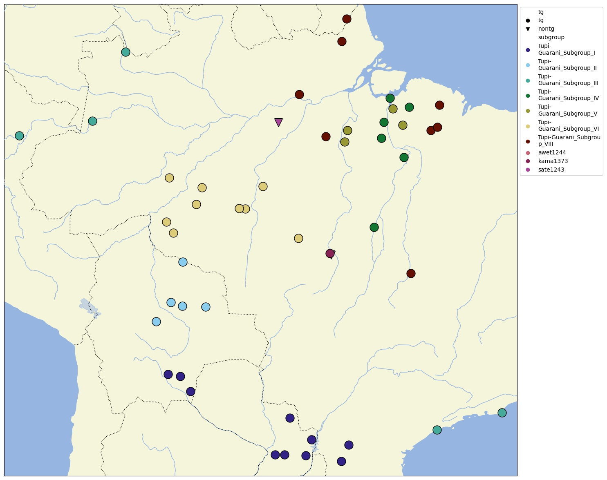

# Mapping subgroups of larger language families

I recently got the following question:

> I would very much like to present a map with the [Maweti-Guarani-languages](https://glottolog.org/resource/languoid/id/mawe1252) in a way where 
> Awetí and Mawé would be represented by different shapes (triangles, for instance) and colours, and the TG languages are represented in the usual 
> circles, but with the languages of the different 8 traditional branches each represented by eight different colours.  So ideally 10 colours, 
> two (or three) shapes.
> The internal branching in Glottolog nicely reflects the state of the art regarding genealogical classification, but it impedes such a representation 
> on the map.  Would that be easy to produce?  How would I proceed?

The [cldfviz package](https://github.com/cldf/cldfviz) recently (v0.7) gained support for
[shapes for map markers](https://github.com/cldf/cldfviz/blob/main/docs/colormaps.md#shapes). So what remains to do is getting the
right data into the right shape to feed it to `cldfviz.map`.

We'll do that by reading the Glottolog CLDF data and writing a [metadata-free](https://github.com/cldf/cldf#metadata-free-conformance)
CLDF StructureDataset with two parameters, one to control the shape and one to control the color of the map markers we want to draw.


## Preliminaries

First, we install the necessary python packages (preferably in a new virtual environment):
```shell
pip install pycldf, csvw, cldfviz
```

We also need
- the Glottolog CLDF dataset (see https://github.com/glottolog/cookbook/blob/master/recipes/glottolog_cldf/README.md#overview)
- a clone or export of the raw Glottolog data repository (https://github.com/glottolog/glottolog)


## Creating the dataset

Assuming the Glottolog CLDF data is available locally at `glottolog-cldf`, we can now assemble the dataset:
```python
from pycldf import Dataset
from csvw.dsv import UnicodeWriter

cldf = Dataset.from_metadata(p)
values = list(cldf.iter_rows('ValueTable', 'value', 'languageReference', 'parameterReference'))

# Select Glottocodes of language-level languoids:
langs = {r['languageReference'] for r in values if r['parameterReference'] == 'level' and r['value'] == 'language'}
# Select Glottocode and classification of all languages under mawe1252:
mawe1252 = {
    r['languageReference']: r['value'] for r in values
    if r['parameterReference'] == 'classification' and 'mawe1252' in r['value'] and r['languageReference'] in langs}
# Select Glottocode and name of the "Tupi-Guarani Subgroup X" subgroups:
tg = {
    r['id']: r['name'].replace(' ', '_')
    for r in cldf.iter_rows('LanguageTable', 'id', 'name')
    if 'Guarani Subgroup' in r['name'] and ('.' not in r['name'])}
# Now write the data to a metadata-free (see https://github.com/cldf/cldf#metadata-free-conformance)
# CLDF StructureDataset with two parameters.
with UnicodeWriter('values.csv') as w:
    w.writerow(['ID', 'Language_ID', 'Parameter_ID', 'Value'])
    for i, (k, v) in enumerate(mawe1252.items(), start=1):
        for kk, vv in tg.items():
            if kk in v:
                w.writerows([
                    ['{}-tg'.format(i), k, 'tg', 'tg'],
                    ['{}-tg'.format(i), k, 'subgroup', vv]])
                break
        else:
            if k == 'kama1373':  # kama1373 isn't classified in an appropriately named TG subgroup so has to be handled as special case.
                w.writerows([
                    ['{}-tg'.format(i), k, 'tg', 'tg'],
                    ['{}-tg'.format(i), k, 'subgroup', k]])
            else:
                w.writerows([
                    ['{}-tg'.format(i), k, 'tg', 'nontg'],
                    ['{}-tg'.format(i), k, 'subgroup', k]])
```

The resulting data will look like [values.csv](values.csv)


## Making the map

Now we can create an interactive HTML map with [cldfviz.map](https://github.com/cldf/cldfviz/blob/main/docs/map.md).
`cldfviz.map` can fetch additional language metadata from Glottolog if the Glottolog data is available locally.
We assume a clone or export of https://github.com/glottolog/glottolog is available at `glottolog`.

```shell
cldfbench cldfviz.map values.csv \
--parameters tg,subgroup \
--glottolog glottolog \
--markersize 20 \
--colormaps '{"tg":"circle","nontg":"triangle_up"},tol'
```

This will create an HTML file like [map.html](map.html) which can be viewed in browser with internet access (to download
the mapping library and the map tiles).

Note that we specifies shapes to be used as "colormap" for the `tg` parameter.

If you have installed `cldfviz` with [support for `cartopy`](https://github.com/cldf/cldfviz#install), you can also
create a map in an image format - suitable for printing:

```shell
cldfbench cldfviz.map values.csv \
--parameters tg,subgroup \
--glottolog glottolog \
--markersize 15 \
--colormaps '{"tg":"circle","nontg":"triangle_up"},tol' \
--format jpg --width 20 --height 15
```



